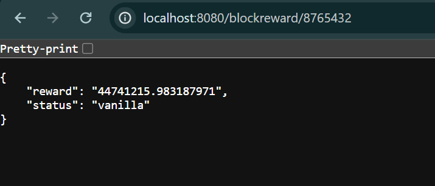
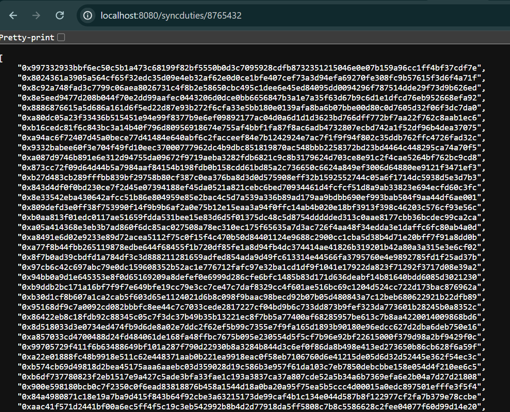
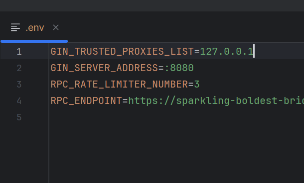
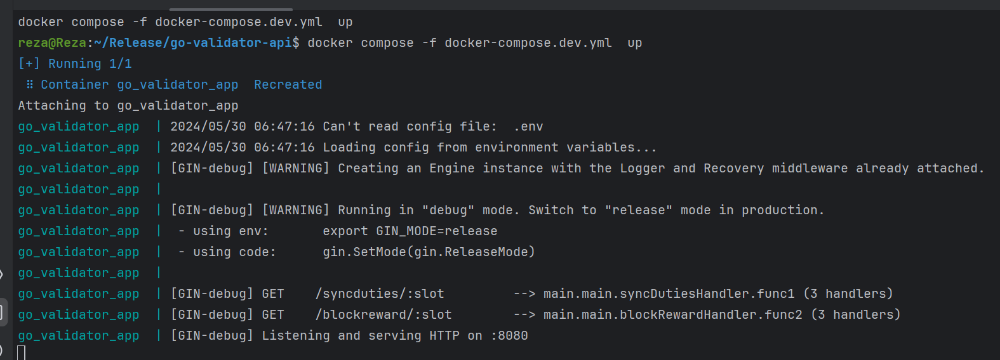

## Description

REST Ethereum Validator API






--------------------------
--------------------------

## Running the app with Docker
```bash
docker compose -f docker-compose.dev.yml  up
```


## Running the app locally( you need Go installed )

- Create an ".env" file, similar to ".env.sample". Fix the value of "RPC_ENDPOINT".
```bash
go run .
```


#### Test

```bash
@todo
```

## Info:
- 📌 gin
- 📌 go-ethereum
- 📌 spf13/viper

#### Swagger UI (for Docker, port is 3008)
@toto

#### Done:
- ✅ GET /blockreward/{slot}
- ✅ GET /syncduties/{slot}


#### Todo:
- 💡 Better naming conventions and folder structure
- 💡 Caching with Redis
- 💡 Include API versioning,


